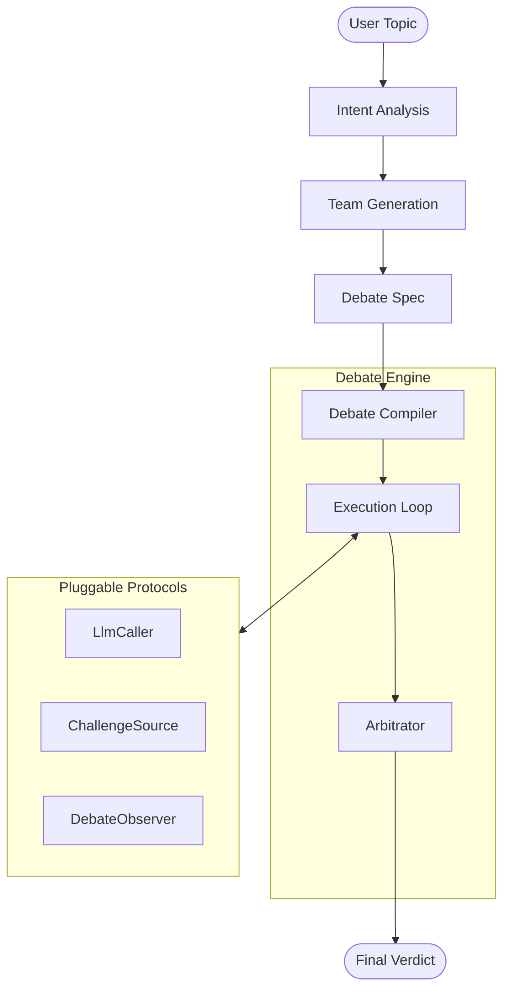

# Agentic Debate ⚔️

**Agentic Debate** is a host-agnostic adversarial debate engine for Python. It orchestrates structured, multi-agent debates where specialized AI personas challenge each other's perspectives, overseen by an impartial arbitrator.

## 💡 Core Feature: "Auto-Team" Brilliance

The `agentic-debate` library's standout capability is **Intent Analysis** and **Auto-Team** generation. Instead of relying on static agents, the library enables a "just-in-time" generation process:

1.  **Intent Analysis (Brainstorming)**:
    -   Analyzes the user's input topic to determine the optimal debate structure.
    -   Reframes the topic and identifies its **Domain** and **Controversy Level**.
    -   Calculates the recommended **Number of Participants** (2–5) and **Rounds** (1–3).

2.  **Auto-Team Generation (Casting)**:
    -   Dynamically creates unique, specialized expert personas tailored to the specific topic.
    -   Assigns each participant a distinct **Role**, **Stance**, and **Visual Identity**.
    -   Ensures a balanced, adversarial environment with truly diverse viewpoints.

---

## 🏗️ Architecture

The system is built on a clean separation between **Planning**, **Debate Logic**, and **LLM Execution**.



-   **Intent & Team Generation**: The core intelligence that converts a simple topic into a structured debate spec.
-   **`DebateEngine`**: The stateless orchestrator that executes the adversarial loop.
-   **Pluggable Protocols**: Allow you to bring your own LLM, challenge sources, and observers.

---

## 🚀 Getting Started

### Installation

```bash
pip install agentic-debate
```

### Run the Demo
The repository includes a full-stack demo that demonstrates the library's auto-team and streaming features.

```bash
cd demo
# Follow instructions in demo/README.md to setup API keys and run
```

---

## 🛠️ How to Use in Other Codebases

To integrate `agentic-debate` into your own project, follow this pattern:

### 1. Perform Intent Analysis
Use the library's intent analysis pattern to prepare the debate.

```python
from backend.gemini import GeminiLlmCaller, intent_analysis, generate_team
from agentic_debate import DebateContext

llm = GeminiLlmCaller()
ctx = DebateContext(namespace="my-app")

# 1. Analyze topic & Generate team
intent = await intent_analysis("Is nuclear power safe?", llm, ctx)
participants = await generate_team(intent, llm, ctx)
```

### 2. Compile and Run the Debate
Wire the generated team into a `DebateSpec` and execute.

```python
from agentic_debate import DebateCompiler, DebateEngine, DebateSpec, DebateSubject

# 1. Setup engine
compiler = DebateCompiler(
    challenge_source=LlmChallengeSource(llm=llm),
    arbitrator=LlmSingleJudgeArbitrator(llm=llm),
    # ... other components
)

# 2. Run with auto-generated participants
spec = DebateSpec(
    namespace="my-app",
    subject=DebateSubject(kind="open_question", title=intent.reframed_topic),
    participants=participants,
    round_policy=RoundPolicy(mode="precomputed", max_rounds=intent.recommended_rounds),
)

compiled = await compiler.compile(spec)
result = await DebateEngine().run(compiled)
```

---

## 📂 Project Structure

-   `src/agentic_debate`: Core library source code.
-   `demo/`: FastAPI & Lit implementation of the core features.
-   `docs/`: Design specifications and architecture plans.
-   `tests/`: Comprehensive test suite.

