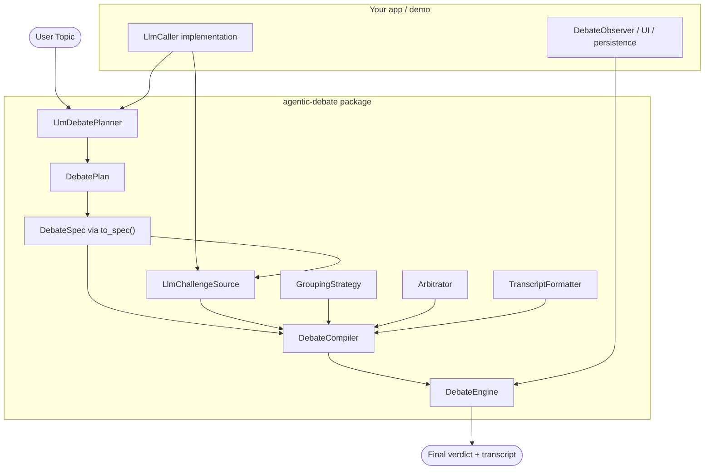

# Agentic Debate ⚔️

**Agentic Debate** is a host-agnostic adversarial debate engine for Python. It orchestrates structured, multi-agent debates where specialized AI personas challenge each other's perspectives, overseen by an impartial arbitrator.

## What Ships Today

The installable package now includes both the neutral execution engine and a provider-neutral planning layer:

- **Planning API**: `LlmDebatePlanner` converts a raw topic into a validated `DebatePlan`
- **Runnable spec generation**: `DebatePlan.to_spec()` converts that plan into a normal `DebateSpec`
- **Built-in generated rounds**: `LlmChallengeSource` generates first-round arguments and rebuttals from any `LlmCaller`
- **Neutral execution engine**: `DebateCompiler` + `DebateEngine` orchestrate grouping, arbitration, synthesis, transcript formatting, localization, and observers
- **Prompt helpers**: packaged prompt templates for planning, challenge generation, and the built-in judge prompt loader

---

## 🏗️ Architecture

The current architecture is built around a clean separation between **planning**, **execution**, and **host adapters**.



### Package Layers

- **Planning**: `agentic_debate.planning` contains `DebateIntent`, `PlannedParticipant`, `DebatePlan`, `DebatePlanner`, and `LlmDebatePlanner`
- **Execution**: `DebateCompiler` and `DebateEngine` stay host-agnostic and operate on a normal `DebateSpec`
- **Generated rounds**: `agentic_debate.methods.rounds.llm.LlmChallengeSource` is the installable generated challenge path
- **Pluggable boundaries**: `LlmCaller`, observers, grouping, arbitration, synthesis, and transcript formatting remain overridable

### What Stays Provider-Neutral

The package does not depend on Gemini, OpenAI, LangGraph, FastAPI, or any other host framework. The only LLM-facing contract inside the package is `LlmCaller`.

---

## 🚀 Getting Started

### Installation

```bash
pip install agentic-debate
```

### Run the Demo
The repository includes a full-stack demo that shows the package-native planning and challenge APIs in a browser with SSE streaming.

```bash
cd demo
# Follow instructions in demo/README.md to setup API keys and run
```

---

## 🛠️ How to Use in Other Codebases

To integrate `agentic-debate` into your own project, follow this pattern.

### 1. Implement an `LlmCaller`
The package is provider-neutral. Bring your own adapter that implements `LlmCaller`.

```python
from typing import TypeVar

from pydantic import BaseModel

from agentic_debate import DebateContext, LlmCaller

T = TypeVar("T", bound=BaseModel)


class MyLlmCaller:
    async def generate_structured(
        self,
        prompt: str,
        response_model: type[T],
        *,
        context: DebateContext,
    ) -> T:
        # Call your provider and return response_model.model_validate(...)
        raise NotImplementedError
```

### 2. Plan the Debate from a Raw Topic
Use the installable planning API to turn a raw topic into a runnable debate plan.

```python
from agentic_debate import DebateContext, LlmDebatePlanner

llm = MyLlmCaller()
ctx = DebateContext(namespace="my-app")

planner = LlmDebatePlanner(llm=llm)
plan = await planner.plan_topic("Is nuclear power safe?", context=ctx)
spec = plan.to_spec(namespace="my-app")
```

`plan` contains normalized intent data, participants, and a runnable `RoundPolicy`. If you want host-specific presentation hints, add them to participant `metadata` before calling `to_spec()`.

### 3. Compile and Run the Debate
Wire the planned spec into the engine and execute it.

```python
from agentic_debate import (
    DebateCompiler,
    DebateEngine,
    GroupByTopicStrategy,
    LlmChallengeSource,
    LlmSingleJudgeArbitrator,
    PassthroughSynthesizer,
    SimpleTranscriptFormatter,
)
from agentic_debate.prompts import load_builtin_judge_prompt

compiler = DebateCompiler(
    challenge_source=LlmChallengeSource(llm=llm),
    grouping=GroupByTopicStrategy(),
    arbitrator=LlmSingleJudgeArbitrator(
        llm=llm,
        prompt_template=load_builtin_judge_prompt(),
    ),
    synthesizer=PassthroughSynthesizer(),
    transcript_formatter=SimpleTranscriptFormatter(),
)

result = await DebateEngine().run(await compiler.compile(spec), context=ctx)
```

### 4. Customize Only Where You Need To

You can start with the installable defaults and override pieces incrementally:

- use `prompt_set=` on `LlmDebatePlanner` to replace planning prompts
- use `prompt_set=` on `LlmChallengeSource` to replace round-generation prompts
- replace `LlmSingleJudgeArbitrator` with your own arbitrator
- add observers for streaming, metrics, or persistence
- skip generated rounds entirely and use `PrecomputedChallengeSource` if your host creates challenges elsewhere

### Minimal End-to-End Example

```python
from agentic_debate import (
    DebateCompiler,
    DebateContext,
    DebateEngine,
    GroupByTopicStrategy,
    LlmChallengeSource,
    LlmDebatePlanner,
    LlmSingleJudgeArbitrator,
    PassthroughSynthesizer,
    SimpleTranscriptFormatter,
)
from agentic_debate.prompts import load_builtin_judge_prompt

ctx = DebateContext(namespace="my-app")
llm = MyLlmCaller()

plan = await LlmDebatePlanner(llm=llm).plan_topic(
    "Should remote work stay the default?",
    context=ctx,
)
spec = plan.to_spec(namespace="my-app")

compiler = DebateCompiler(
    challenge_source=LlmChallengeSource(llm=llm),
    grouping=GroupByTopicStrategy(),
    arbitrator=LlmSingleJudgeArbitrator(
        llm=llm,
        prompt_template=load_builtin_judge_prompt(),
    ),
    synthesizer=PassthroughSynthesizer(),
    transcript_formatter=SimpleTranscriptFormatter(),
)

result = await DebateEngine().run(await compiler.compile(spec), context=ctx)
print(result.transcript["summary"])
```

---

## 📂 Project Structure

- `src/agentic_debate`: package source code
- `src/agentic_debate/planning`: installable planning API
- `src/agentic_debate/methods/rounds`: built-in round sources, including `LlmChallengeSource`
- `src/agentic_debate/prompts`: packaged prompt assets and loaders
- `demo/`: FastAPI + TypeScript + Three.js chamber demo that consumes the package APIs
- `docs/`: design specifications and implementation plans
- `tests/`: package-level test suite
