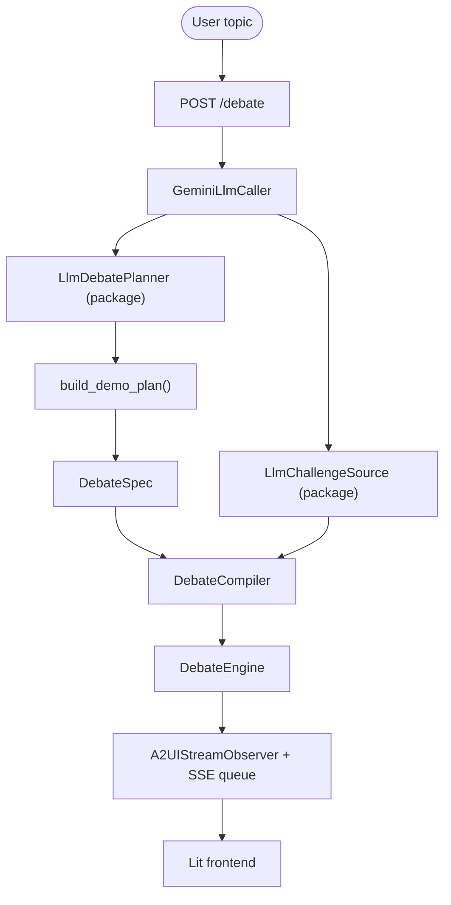

# Agentic Debate Demo — Setup & Run

This directory contains a self-contained web demo of the `agentic-debate` package. The demo is intentionally thin: it uses the installable planning and challenge-generation APIs from `src/agentic_debate` and adds only the Gemini adapter, localization, SSE streaming, and browser UI.

## Architecture

The demo is split into three layers:

- **Package layer**: `LlmDebatePlanner`, `LlmChallengeSource`, `DebateCompiler`, and `DebateEngine`
- **Demo backend adapters**: Gemini `LlmCaller`, demo planning decoration (`accent_color` metadata), SSE message streaming, and FastAPI endpoint wiring
- **Demo frontend**: Lit + A2UI surface that renders the streamed debate progressively



### Backend Responsibilities

- `backend/gemini.py`: provider adapter and translation/localization helper
- `backend/planning.py`: calls package `LlmDebatePlanner` and adds demo-only accent color metadata
- `backend/main.py`: FastAPI endpoint, SSE queue, package compiler/engine wiring
- `backend/streamer.py`: converts observer events and generated challenges into A2UI messages

### Frontend Responsibilities

- `frontend/main.js`: submits the topic, reads SSE events, and forwards them to the A2UI surface
- `frontend/style.css`: demo presentation
- `frontend/index.html`: input shell and surface mount

## Using `agentic-debate` in Another Codebase

This demo is not the public API. If you want to embed the debate system in another codebase, import from `agentic_debate`, not from `demo/backend/*`.

The integration pattern is:

1. implement `LlmCaller` for your provider
2. call `LlmDebatePlanner` to convert a topic into a `DebatePlan`
3. call `plan.to_spec(namespace=...)`
4. compile with `LlmChallengeSource`, grouping, arbitrator, synthesizer, and transcript formatter
5. run with `DebateEngine`

Minimal example:

```python
from agentic_debate import (
    DebateCompiler,
    DebateContext,
    DebateEngine,
    GroupByTopicStrategy,
    LlmChallengeSource,
    LlmDebatePlanner,
    LlmSingleJudgeArbitrator,
    PassthroughSynthesizer,
    SimpleTranscriptFormatter,
)
from agentic_debate.prompts import load_builtin_judge_prompt

ctx = DebateContext(namespace="my-app")
llm = MyLlmCaller()

plan = await LlmDebatePlanner(llm=llm).plan_topic(
    "Should AI replace doctors?",
    context=ctx,
)
spec = plan.to_spec(namespace="my-app")

compiler = DebateCompiler(
    challenge_source=LlmChallengeSource(llm=llm),
    grouping=GroupByTopicStrategy(),
    arbitrator=LlmSingleJudgeArbitrator(
        llm=llm,
        prompt_template=load_builtin_judge_prompt(),
    ),
    synthesizer=PassthroughSynthesizer(),
    transcript_formatter=SimpleTranscriptFormatter(),
)

result = await DebateEngine().run(await compiler.compile(spec), context=ctx)
```

## Prerequisites

- **Python 3.12+**
- **Node.js & npm** (for building the frontend)
- **Gemini API Key**: You need a valid API key from Google AI Studio.

## Step-by-Step Setup

### 1. Configure the Backend

Navigate to the `demo` directory and install the Python dependencies:

```bash
cd demo
pip install -r requirements.txt
pip install -e ..
```

### 2. Build the Frontend

Vite is used to build the Lit-based frontend assets. These are served as static files by FastAPI.

```bash
cd frontend
npm install
npm run build
cd ..
```

### 3. Set Environment Variables

Export your Gemini API key:

```bash
export GEMINI_API_KEY="your_api_key_here"
```

### 4. Run the Application

Start the FastAPI server using `uvicorn`:

```bash
uvicorn backend.main:app --reload
```

The application will be available at [http://localhost:8000](http://localhost:8000).

## 🛠️ Development Mode

For a better development experience with hot-reloading for both backend and frontend:

1. **Start Backend**: in one terminal, run `uvicorn backend.main:app --reload` in the `demo` directory
2. **Start Frontend**: in another terminal, run `npm run dev` in the `demo/frontend` directory
3. **Access**: open [http://localhost:5173](http://localhost:5173); the frontend proxies `/debate` to the backend on port 8000

> [!NOTE]
> If you get an `Address already in use` error for port 8000, find and kill the process using:
> `lsof -i :8000` then `kill -9 <PID>`

## 🧪 Running Tests

To verify the backend implementation, you can run the test suite:

```bash
cd demo
python -m pytest tests/
```

## Features Demonstrated

- **Package-native planning**: topic -> `DebatePlan` -> `DebateSpec`
- **Package-native challenge generation**: generated opening arguments and rebuttals
- **Demo-only presentation decoration**: participant accent colors via metadata
- **Real-time SSE streaming**: debate output appears progressively in the browser
- **LLM-backed arbitration**: final verdict generated from the package judge flow
